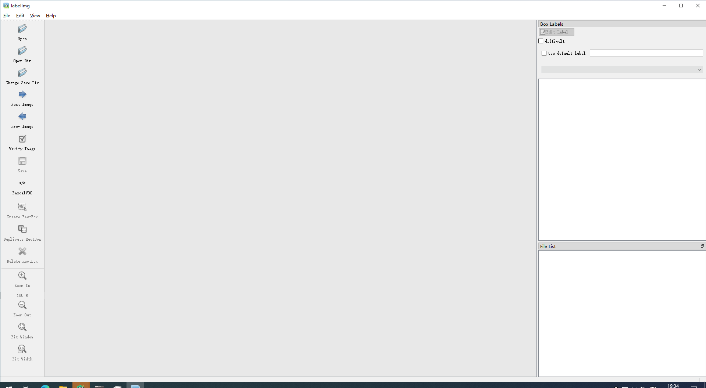

# Faster R-CNN
## 环境配置：
* Python3.6
* Pytorch1.6
* pycocotools(Linux: pip install pycocotools;   
Windows:pip install pycocotools-windows(不需要额外安装vs))

## 文件结构：
本地路径："G:\xqy\faster_rcnn"
```
* ├── backbone: 特征提取网络，可以根据自己的要求选择
* ├── network_files: Faster R-CNN网络（包括Fast R-CNN以及RPN等模块）
* ├── train_utils: 训练验证相关模块（包括cocotools）
* ├── my_dataset.py: 自定义dataset用于读取VOC数据集
* ├── train_mobilenet.py: 以MobileNetV2做为backbone进行训练
* ├── train_resnet50_fpn.py: 以resnet50+FPN做为backbone进行训练
* ├── train_multi_GPU.py: 针对使用多GPU的用户使用
* ├── predict.py: 简易的预测脚本，使用训练好的权重进行预测测试
* ├── pascal_voc_classes.json: pascal_voc标签文件
```

## 数据集
* Pascal VOC2012 train/val数据集下载地址：http://host.robots.ox.ac.uk/pascal/VOC/voc2012/VOCtrainval_11-May-2012.tar
* PCB_DATASET：参考https://github.com/Ixiaohuihuihui/Tiny-Defect-Detection-for-PCB
* DAGM_DATASET：参考https://www.pythonf.cn/read/127802
* CAMERA_DATASET：本项目的数据集，目前已采集fpccrease(FPC表面划痕)
* 以上数据集本地都有，且都跑通，有不错的测试结果

## 项目流程

### Step1 确保提前准备好数据集
* 首先的数据的采集（网上找或者拍照）与增强（用CV方法进行P图或者用SinGAN生成训练样本），之后进行标注  
    1、**拍照**：相机得到图像为bmp图像，VOC要求图像格式为JPEG，根目录下的`trans_xml.py`可以实现批量改名（也可以修改xml标注文件的具体节点）  
    2、**CV方法**：运行`python image_expand.py`将generated路径下的每个图像样本按照0.4~1的比率随机裁剪，并按1/4的概率选择翻转模式，每个样本生成20个样本  
    3、**SinGAN方法**：相关参数配置已在本地安装好，更多细节参见https://github.com/tamarott/SinGAN  
        * 将要生成新样本的图片放在"G:\xqy\SinGAN-master\Input\Images"路径下  
        * 运行`conda activate pytorch13`激活Pytorch13环境  
        * 在"G:\xqy\SinGAN-master"输入`python main_train.py --input_name <input_file_name>`，默认生成的图像最长边为500，改大网络会训练很慢，可以选择改小  
        * 训练完毕后，在TrainedModels文件夹下会生成每个金字塔层的图像信息，并保留网络权重  
        * 运行：  
        `python random_samples.py --input_name <training_image_file_name> --mode random_samples --gen_start_scale <generation start scale number>`  
        生成新图像数据，`generation start scale number`表明通过第几层金字塔的G权重进行图像生成，层数越高对应的图像与原图相似度越高，因而选较低且不丧失原图特性的层数会较好，
        生成的新图像会保存在"G:\xqy\SinGAN-master\Output\RandomSamples"目录下  
        * 由于SinGAN生成的图像通道数为4，根目录下提供了`split_channel.py`文件可将其转化为3通道图像
        
* 标注选用常见的VOC2012格式，文件结构如下，不用管为啥这么排（其实是因为VOC还提供图像分割功能，而我们用不上，所以是这种结构）：  
```
数据集文件夹名称(如CAMERA_DATASET)
* ├── Annotations: 存放样本图像的标注文件信息
* ├── ImageSets
    ├──Main 
        ├──train.txt：内部每一行都是一个训练样本的名称
        ├──test.txt：内部每一行都是一个验证样本的名称
* ├── JPEGImages: 存放样本图像
```  
* 标注工具在Anaconda环境的pytorch16中，终端使用`conda activate pytorch16`激活环境后，键入`labelimg`启动标注工具，此部分可以参考：https://blog.csdn.net/qq_27871973/article/details/84106067



    1、先点击左侧Change Save Dir 选择要保存标注文件的路径，如(CAMERA_DATASET/Annotations)  
    2、之后点击Open Dir选择要标注的样本图片路径，如(CAMERA_DATASET/JPEGImages)   
    3、确定左侧的save下面为PascalVOC以确保保存的标注格式为VOC格式  
    4、之后进行标注，标注的时候应该尽可能细，因为这是监督信息，根本上决定了训练的模型好坏，就按照我们希望它识别出的结果来标，且有一定自己的标准  

* 标注完成后，还缺少Main文件下的两个txt文件，这里需要用本项目下的`spilt_data.py`脚本生成，运行脚本前，请修改该脚本的标注文件根目录，如(CAMERA_DATASET/Annotations)，并按我们的期望划分训练集和验证集（小样本2：8就行，测试集需要在划分前挑选出少量放到一边），之后将生成的test和train文件放到数据集的Images\Main下面
* 新建存放具体类别的**字典**文件（取决于标注时的输入），如`camera_dataset.json`
* 之后，需要新建继承了Pytorch的DataSet类的数据集文件，如`camera_dataset.py`

### Step2 确保提前下载好对应预训练模型权重（下载后放入backbone文件夹中，并改名）
* MobileNetV2 backbone: https://download.pytorch.org/models/mobilenet_v2-b0353104.pth
* ResNet50+FPN backbone: https://download.pytorch.org/models/fasterrcnn_resnet50_fpn_coco-258fb6c6.pth

### Step3 训练前期的路径及参数调整
* `train_res50_fpn.py`中需要导入我们自己定义的数据集，进行部分路径的修改，类别数num_classes。  
    调优参数修改：learning rate(lr),lr调整策略,总epoch数(一般来说越大越好，要与lr之间平衡好)和batch_size(不爆内存的最大值),几种正则化的参数  
* 另一个调优要修改的参数主要在`network_files/faster_rcnn_framework.py`中，FasterRCNN类下的proposal数,NMS阈值

### Step4 训练模型
* `conda activate pytorch16`
* 若要训练mobilenetv2+fasterrcnn，直接使用`python train_mobilenet.py`训练脚本
* 若要训练resnet50+fpn+fasterrcnn，直接使用`python train_resnet50_fpn.py`训练脚本
* 若要使用多GPU训练，使用```python -m torch.distributed.launch --nproc_per_node=2 --use_env train_multi_GPU.py```指令,```nproc_per_node```参数为使用GPU数量

### 测试结果
训练结束后，本地根目录下会生成mAP和loss图。在本地添加test.jpg文件，通过`python predict.py`可以得到测试结果图。


## 学习资料
**学习网络框架**  
* 代码部分学习（整体框架修改自此代码）  
https://github.com/WZMIAOMIAO/deep-learning-for-image-processing
* 代码部分讲解及基础  
https://space.bilibili.com/18161609?from=search&seid=15900069256992135357

**模型改进点**
* 参考铝件缺陷检测（铝件数据集本地已经下好）  
https://blog.csdn.net/sinat_17456165/article/details/106760612 

**模型部署**
* 参考百度（Windows下C#调用dll）  
https://blog.csdn.net/SMF0504/article/details/109275908

